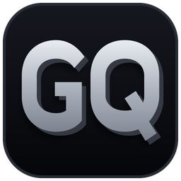

  

<h1 align="center">GateQuake</h1>

  <b>Last one standing takes the whole pot.</b> 
  A browser battle royale played for real stakes on Solana.

  <a href="https://gatequake.com"><b>Play at gatequake.com</b></a>

---

## What it is

Up to 36 fighters drop into a brutalist arena suspended over an endless
void. Periodic earthquakes shake the perimeter into the abyss and void
random interior tiles, so the solid ground never stops shrinking. There
is nowhere to camp. Last one alive wins.

Combat is melee and thrown weapons — fists, knife, sword and hammer,
each with four attack variants — alongside grenades, jetpacks and shield
crystals that spawn through the match.

**No download. No install. No wallet needed to try it.**

## Free to play, for real

One **Practice** gate is completely free. No wallet, no deposit, no
signature — the full game, with bots and creatures to fight. You can
learn every mechanic without spending anything.

Nine **paid gates** run escalating stakes. The winner of a paid match
takes the entire pot.

| Gate | Buy-in | Winner takes (full room) |
|---|---:|---:|
| PRACTICE | Free | — |
| GRIT | 1 GQ | 36 GQ |
| COPPER | 10 GQ | 360 GQ |
| BRONZE | 100 GQ | 3.6K GQ |
| SILVER | 1K GQ | 36K GQ |
| GOLD | 10K GQ | 360K GQ |
| PLATINUM | 100K GQ | 3.6M GQ |
| DIAMOND | 1M GQ | 36M GQ |
| MASTER | 10M GQ | 360M GQ |
| MYTHIC | 100M GQ | 3.6B GQ |

Three **tournament gates** unlock at 10, 50 and 100 lifetime wins.
Three **VIP gates** unlock at $50K, $250K and $500K lifetime wagered.

## GQ, plainly

GQ is the in-game credit. It is **not** a token, not an NFT, not a coin
you can trade. There was no presale and there is no mint.

- **Deposit:** 1 USDC = 1,000 GQ
- **Withdraw:** 1,000 GQ = 0.97 USDC

That 3% is the only cut the house takes. There is no rake on pots, no
entry fee on top of the buy-in, and no charge for playing Practice.

Deposits and withdrawals are USDC on Solana. You can withdraw to any
Solana address you control.

## Read before you play

| | |
|---|---|
| [How to play](docs/HOW_TO_PLAY.md) | Controls, gates, and how a match runs |
| [Match rules](docs/RULES.md) | Payouts, disconnects, refunds, gate requirements |
| [Fair play & security](docs/SECURITY.md) | How results are decided and how funds are handled |
| [Responsible play](docs/RESPONSIBLE_PLAY.md) | **Real money. 18+. Read this one.** |
| [FAQ](docs/FAQ.md) | Short answers to the common questions |
| [Terms & Conditions](docs/TERMS.md) | The agreement you accept by playing |
| [Privacy](docs/PRIVACY.md) | What we collect and what we don't |

## Community

Channels are being set up now — links land here as they open.
See [ROADMAP.md](ROADMAP.md).

---

GateQuake involves wagering real money on the outcome of a game.
You must be 18 or older, and it must be legal where you are. Play only
with money you can afford to lose. See
<a href="docs/RESPONSIBLE_PLAY.md">Responsible play</a>.
